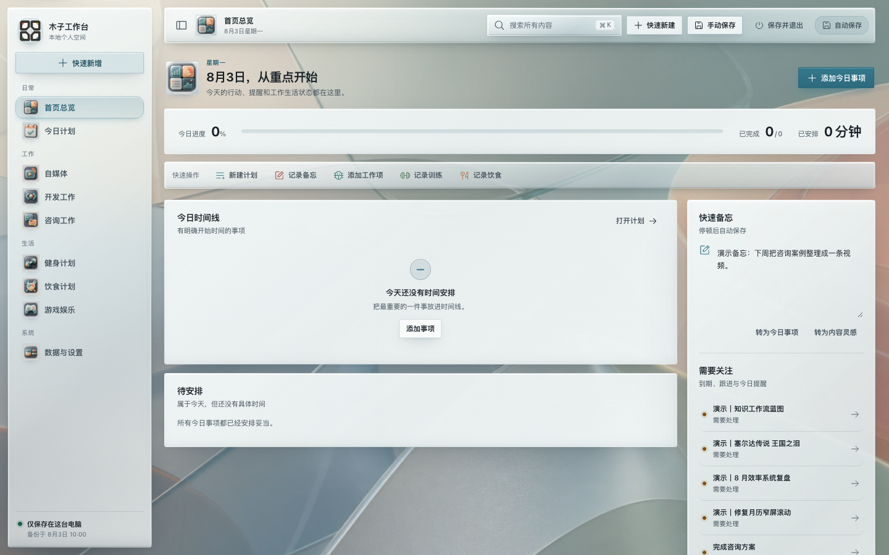
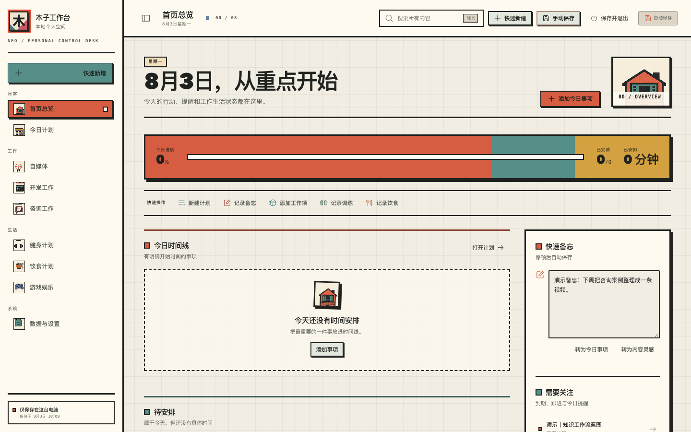

# 木子工作台

木子工作台是一款只在自己电脑上运行的工作与生活管理应用。它把计划、创作、开发、咨询、健身、饮食和娱乐放进同一个本地控制中心，不需要注册账号，也不依赖云数据库。

应用默认只监听本机地址 `127.0.0.1`。业务数据保存在独立的 SQLite 文件中，刷新页面、关闭浏览器或重新启动电脑后都不会丢失。

## 主要功能

- 首页总览：今日进度、重点事项、快速备忘、模块摘要和快捷操作。
- 今日计划：时间安排、优先级、完成状态、延期和每日复盘。
- 自媒体：内容灵感、制作流程、发布状态和发布后数据图表。
- 开发工作：项目、里程碑、工作项、优先级和开发日志。
- 咨询工作：客户、项目、沟通、交付物、跟进和咨询时长。
- 健身计划：训练日历、训练模板、动作、组数、次数和重量记录。
- 饮食计划：饮食日历、餐次、食物、营养目标和实际摄入。
- 游戏娱乐：游玩清单、进度、目标、计时和个人记录。
- 数据与设置：手动保存、备份、恢复、导出、回收站和界面偏好。

界面支持三种独立外观，并且每种外观都支持浅色与深色主题：

- 流光玻璃：环境色、透明材质和柔和空间层级。
- Notion 笔记：紧凑画布、纯平表面和低饱和状态标记。
- Neo-Brutalism：多色印刷、硬边框和机械反馈。

外观切换只改变界面，不会复制、迁移或清空业务数据。

## 三种界面风格预览

下面三张截图来自同一个本地工作台、同一份演示数据和相同的 `1440 × 900` 浏览器视口。

### 流光玻璃



### Notion 笔记


### Neo-Brutalism



## 支持的电脑系统

| 系统 | 启动文件 | 默认数据目录 | 打开目录命令 |
| --- | --- | --- | --- |
| macOS | `启动木子工作台.command` | `~/Library/Application Support/MuziWorkspace/` | 系统 `open` |
| Windows 10/11 | `启动木子工作台.bat` | `%LOCALAPPDATA%\MuziWorkspace\` | `explorer.exe` |

项目使用同一套 React、Fastify 和 SQLite 代码运行在两个系统上。启动器、数据路径、浏览器打开方式和目录打开方式都按当前系统自动选择。仓库的持续集成会分别在 GitHub 提供的 macOS 与 Windows 环境运行构建、数据库、启动器和生产服务测试。

> 当前仓库提供的是源代码版本，不是经过 Apple 公证或 Windows 代码签名的安装包。首次使用需要安装 Node.js 并执行一次依赖安装。

## 第一次安装

### 第一步：安装 Node.js

安装 Node.js `22.13.0` 或更高版本。安装完成后打开终端，确认下面两个命令能够显示版本号：

```bash
node --version
npm --version
```

### 第二步：下载项目

可以克隆仓库：

```bash
git clone https://github.com/TianyiDataScience/muzi-workspace.git
cd muzi-workspace
```

也可以在 GitHub 仓库页面选择“代码 → 下载 ZIP”，解压后进入项目目录。

### 第三步：安装依赖

在项目目录运行：

```bash
npm install
```

只有安装依赖时需要联网。安装完成后，木子工作台的日常运行、保存、备份和恢复都不需要联网。

## 日常启动

### macOS

双击项目根目录中的 `启动木子工作台.command`。

如果系统提示文件没有执行权限，在项目目录运行一次：

```bash
chmod +x "启动木子工作台.command"
```

如果 macOS 阻止首次打开，可以在 Finder 中右键该文件，选择“打开”，确认后再次运行。

### Windows

双击项目根目录中的 `启动木子工作台.bat`。

批处理文件会自动进入它所在的项目目录，因此项目路径中包含中文或空格也可以正常启动。如果 Windows 阻止从网络下载的脚本，可在文件属性中选择“解除锁定”，确认文件来自本仓库后再运行。

### 启动器行为

启动器会执行以下操作：

1. 检查 `127.0.0.1:4317` 上是否已有当前版本的木子工作台。
2. 首次运行时生成本地生产构建。
3. 已经运行时复用原服务，不会重复启动多个进程。
4. 构建版本变化时先保存 SQLite，再安全替换旧服务。
5. 服务正常后打开系统默认浏览器。

也可以在终端中运行：

```bash
npm run app:start
```

## 保存与退出

- 页面顶部的“手动保存”会先提交仍在编辑的草稿，再执行 SQLite 检查点与完整性检查。
- 页面顶部的“保存并退出”会完成保存，然后安全关闭本地服务。
- 直接关闭浏览器页面不会停止服务；下次双击启动文件会继续复用。
- 电脑关机时系统会结束后台服务，已经提交到 SQLite 的数据不会受影响。

应用没有面向用户的“停止脚本”。正常退出请使用页面中的“保存并退出”。

## 本地数据、备份与恢复

数据目录结构在 macOS 与 Windows 上相同：

```text
MuziWorkspace/
├── data/
│   └── app.sqlite
├── backups/
├── exports/
└── logs/
    └── app.log
```

- `app.sqlite` 是唯一主数据库。
- `backups` 保存完整 SQLite 备份和备份索引。
- `exports` 保存 JSON 与各模块 CSV 组成的 ZIP 导出包。
- `app.log` 记录本地服务启动与运行信息。

恢复备份前，应用会先创建一份“恢复前安全备份”。恢复文件会经过可读取性、SQLite 完整性和数据库版本检查，失败时不会覆盖当前主数据。

需要迁移电脑时，建议先点击“保存并退出”，再复制整个 `MuziWorkspace` 数据目录。

## 隐私与安全边界

- 不需要登录、账号、Cookie 同意或云数据库。
- 不会加载在线字体、在线图片或在线图标。
- 生产服务只绑定 `127.0.0.1`，不会主动暴露给局域网。
- 修改数据的接口会拒绝非本机网页来源。
- 本机数据库、备份、导出、日志、测试结果和环境变量文件都不会提交到 Git 仓库。

## 开发方式

安装依赖后运行：

```bash
npm run dev
```

开发页面位于 `http://127.0.0.1:3000`，本地接口默认位于 `http://127.0.0.1:4317`。

常用命令：

```bash
npm run lint          # 代码规范检查
npm run typecheck     # 前端与服务端类型检查
npm test              # 单元、组件和集成测试
npm run build         # 生成生产构建
npm start             # 前台运行已经生成的生产构建
npm run test:e2e      # 运行真实浏览器端到端验收
npm run test:all      # 运行全部检查与测试
```

## 技术结构

- React 与 Vite：本地桌面浏览器界面。
- Fastify：只对本机开放的接口与生产静态资源服务。
- SQLite 与 better-sqlite3：独立数据文件、事务、检查点和完整备份。
- TanStack Query：界面数据刷新、操作状态与错误处理。
- Vitest、Testing Library 与 Playwright：单元、组件、集成和真实浏览器验收。

主要目录：

```text
database/      数据库迁移
docs/          产品、接口、数据和运行文档
public/        本地图标与视觉资源
scripts/       跨平台启动和测试准备脚本
server/        Fastify、SQLite、备份与业务存储
src/           React 页面、组件与三套外观
tests/         单元、组件、集成、生产和端到端测试
```

## 进一步文档

- [产品需求文档](PRD.md)
- [运行、备份与恢复手册](docs/OPERATIONS.md)
- [数据模型](docs/DATA_MODEL.md)
- [本地接口说明](docs/API.md)
- [验收范围](docs/ACCEPTANCE.md)

## 参与贡献

欢迎提交问题和改进建议。提交代码前请运行：

```bash
npm run test:all
```

请不要在问题、日志或截图中公开自己的 SQLite 数据文件、备份内容、私人计划或本机绝对路径。

## 开源许可证

本项目使用 [MIT 许可证](LICENSE)。你可以使用、修改和分发本项目，但需要保留许可证与版权声明。
